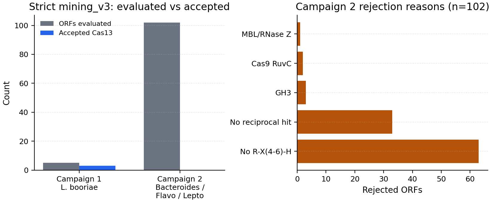
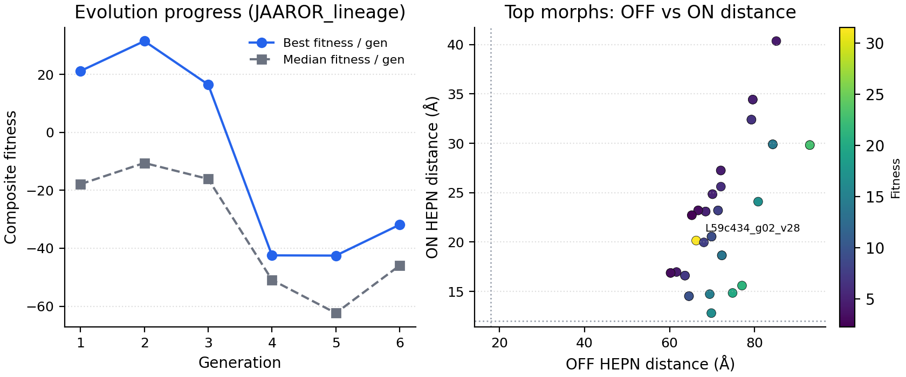
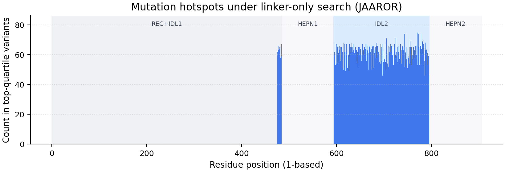

# Abstract

CASCADE (Cas Collateral Activation — Discovery and Engineering) is open-source
software for two jobs that are usually done by hand: (1) pull Cas13-like
effectors out of metagenomic contigs with strict quality filters, and (2) redesign
only the **inter-domain linkers** of those enzymes so a structure model predicts
a clearer OFF versus ON catalytic geometry. The RNA-binding (REC) region and the
wild-type HEPN active-site sequences stay frozen. PXDesign and ProteinMPNN
propose linker changes; Protenix or Cattle-Prod scores unbound, trigger-bound,
and mismatch complexes; an online adapter (`EvolutionGym`) turns relative fitness
into a ProteinMPNN bias matrix for the next generation. We demonstrate the stack
on three verified *Listeria booriae* Cas13a proteins and shortlist linker morphs
for wet-lab follow-up. No design in the archived compute budget met the preset
elite thresholds; that shortfall is attributed primarily to limited GPU funding
for longer evolution campaigns, not to a claim that the scaffolds are exhausted.
All results are *in silico*.

# Statement of need

Calling a structure model or an inverse folder once is easy. Running them as a
**closed, constrained search** is not: unconstrained redesign often damages
catalysis, and single-state confidence scores do not measure a switch
[@abramson2024af3; @protenix2024; @dauparas2022mpnn]. CRISPR CAD tools such as
ADAPT [@metsky2022adapt] and BADGERS [@badgers2024] optimize guides for
detection. CASCADE targets a complementary problem—**effector mechanics**—with
explicit freeze maps, two-state (plus mismatch) scoring, hierarchical oracle
cost, and a miner that logs rejection reasons so false Cas13 calls do not poison
the search [@cascade_audit2026].

Intended users are computational biologists and engineers who need a
reproducible pipeline around PXDesign [@pxdesign2025], ProteinMPNN, and
Protenix-compatible oracles, including optional Cattle-Prod.

# State of the field

Diffusion binders and global MPNN redesign optimize interfaces or monomer
metrics. CASCADE encodes a narrower policy: freeze recognition and catalysis,
mutate mechanical couplers, score conformational hypotheses. Stitching restores
wild-type HEPN segments after generation. Evaluations are written to JSONL for
optional offline fine-tuning [@wang2024drakes]. Generators and oracles remain
external projects; CASCADE does not redistribute model weights.

# Software design

{#fig:loop}

CASCADE is organized so mining quality, oracle cost, and search feedback can
change independently. The scientific entrypoint is
`scripts/evolution_orchestrator.py` (smoke path: `scripts/smoke_gpu.sh`).

- **Phase 0 — mining.** `mining_v3.py` applies length gates, canonical
  `R-X(4-6)-H` HEPN pairs, hard anti-signatures (e.g. GH3, MetH, AAA+, Cas9
  RuvC), reciprocal homology to a Cas13 reference FASTA, and CRISPR-array–aware
  direct-repeat assignment, with a rejection reason on every discarded ORF.
- **Phase 1 — bootstrap.** Sequences and metadata land in SQLite; HEPN
  motifs are anchored; native DRs become crRNAs; optional mini/base structure
  screens produce starting CIFs.
- **Phase 2 — evolution.** Gen 0 scores the unmodified enzyme. Gen 1 explores
  linker backbone geometry (PXDesign). Gen 2+ inverse-folds a cached backbone
  with ProteinMPNN while gradually unfreezing linker sites (about 10% → 50%)
  and applying an EvolutionGym PSSM. Wild-type HEPN sequences are stitched back
  before scoring. Mini OFF/ON predictions gate which designs receive expensive
  ternary and mismatch jobs. Relative fitness updates mutation weights for the
  next round.

# Methods

## Mining (`mining_v3`)

Input: assembled contigs (FASTA). Candidate ORFs in a Cas13-like length window
(default 600–1400 aa) are retained only if they contain a valid pair of
canonical HEPN motifs (`R-X(4-6)-H`) with spacing compatible with Type VI
architecture. ORFs matching diagnostic non-Cas13 signatures are rejected.
Survivors must reciprocally align to `data/cas13_reference_db.fasta` above
configured identity and block-length cutoffs (defaults used in the remine:
≥30% identity over ≥80 aa). CRISPR arrays are detected with coordinate-aware
assignment so direct repeats are taken from nearby arrays rather than naive
k-mers. Every rejection is written with a machine-readable reason, enabling
false-positive audits [@cascade_audit2026].

## Baseline annotation and domain freeze map

For each accepted effector, `01_parse_and_annotate.py` (and related helpers)
records sequence length, subtype hints, the chosen native DR, and HEPN
boundaries. For the three *L. booriae* baselines used here, domain metadata
places **HEPN1 at residues 484–594** and **HEPN2 at 795–905** (1-based). The
N-terminal block through HEPN1 start is treated as REC plus IDL1; the segment
between HEPN1 and HEPN2 is IDL2. Generators may redesign linker coordinates
only; HEPN sequences are restored by `hepn_structural_stitch.py` after
sampling. Unknown residues (`X`) are resolved to the baseline amino acid when
possible, otherwise glycine. Stitch failures incur a fixed fitness penalty
(default 5.0).

## Trigger RNA and complex jobs

Default oncology-oriented triggers live in `data/fusion_targets.json` (e.g.
BCR-ABL1, EWSR1-FLI1, TMPRSS2-ERG). Spacers are subtype-length adjusted and
embedded in OFF (protein + crRNA) and ON (protein + crRNA + target) prediction
payloads via `scripts/utils/protenix_eval.py`. Mismatch jobs mutate 1, 2, or 3
nucleotides in the spacer to probe predicted leak.

## Structure oracle and hierarchical evaluation

`EVAL_CMD` selects Cattle-Prod or Protenix. Each candidate is first scored with
a cheaper mini model on OFF and ON. Catalytic geometry is summarized as the
His NE2–NE2 distance between HEPN histidines (`pdb_kinematics.py`). Software
gates (defaults) are **OFF ≥ 18 Å** and **ON ≤ 12 Å**. Designs that pass may
be promoted to base-model ternary evaluation and mismatch panels. These
Ångström cutoffs are **design thresholds**, not experimentally calibrated
catalytic distances.

## Generators

- **Generation 1:** PXDesign proposes linker/backbone geometry while the freeze
  map keeps REC and HEPN regions fixed in the design specification.
- **Generation ≥ 2:** ProteinMPNN redesigns a subset of linker positions on a
  cached backbone. Unfreeze fraction increases with generation
  (`0.10 + 0.05·gen`, capped at 0.50). Positions with strong EvolutionGym bias
  are preferentially unfrozen. Soft PSSM guidance is passed with
  `--pssm_multi 0.5`. Sampling temperature anneals across generations.

## Fitness and EvolutionGym

Composite fitness rewards a large OFF−ON distance shift, higher ipTM and AF2-IG,
a bonus for full ternary evaluation, and progressive penalties when mismatch
jobs show HEPN closure:

$$
\begin{aligned}
f &= \Big[(d_{\mathrm{OFF}}-d_{\mathrm{ON}})-(18-12)\\
&\quad + 50(\mathrm{ipTM}-0.7) + 20(\mathrm{AF2\textrm{-}IG}-0.5)\Big]\\
&\quad \times \begin{cases}2 & \text{full ternary}\\ 1 & \text{otherwise}\end{cases}
- \sum_{m\in\{1,2,3\}} 0.3\, m\, \max(0,\, 18 - d_m).
\end{aligned}
$$

At the end of each generation, EvolutionGym centers fitness on the Gen-0
baseline (else the generation mean), divides by the generation spread, and
updates each substitution key with an EMA (`0.5` old + `0.5` relative). Weights
are clipped to $[-5,5]$ and exported as `mpnn_bias_gen_*.json`. Insertions and
deletions are excluded from the PSSM. Population size, tournament size,
stagnation limit, and variants per generation are environment-configurable
(defaults: population 3, tournament 2, stagnation 4, 5 variants/gen, up to 12
generations when funded).

## Elite criteria and stopping

A design is labeled elite only if ipTM ≥ 0.85, AF2-IG ≥ 0.80, and ON ≤ 12 Å
(with OFF still satisfying the dormant gate). Lineages stop early on stagnation
or when compute is exhausted. Every evaluation can be appended to
`rl_training_dataset.jsonl` for later analysis or post-training.

## Reproducibility

CPU unit tests cover fitness, stitching, kinematics helpers, and related
modules without GPU. Seeds are controllable via `--seed` / `CASCADE_SEED`.
Figures in this paper are regenerated with `scripts/build_paper_figures.py`
from archived mining summaries and RL JSONL.

# Demonstration: three Cas13a baselines and designed morphs

## Proteins retained after remine

Strict remine kept three *L. booriae* Cas13a ORFs with adjacent CRISPR arrays
[@cascade_audit2026]:

| Pipeline ID (abbrev.) | Contig | Length (aa) | Native DR (RNA, truncated) | Best ref hit |
|:----------------------|:-------|----------:|:---------------------------|:-------------|
| NZ_JAASWF…_HIGH | NZ_JAASWF010000012.1 | 1052–1064 | `UACCUCAAAACAGAAGAGGACUA…` | LseCas13a ~39% / ~1028 aa |
| NZ_JAAROR…_HIGH | NZ_JAAROR010000001.1 | 1056 | `GAGUACCUCAAAACAGAAGAGGACUAAA…` | LseCas13a ~39% / ~1020 aa |
| NZ_JAARYF…_HIGH | NZ_JAARYF010000017.1 | 1052 | `GAUUUAGAGUACCUCAAAACAGAAGAGG…` | LseCas13a ~39% / ~1016 aa |

Each shows multiple canonical HEPN pairs and a Cas13a-like DR family. They are
*Listeria* Type VI-A homologs (related to characterized / patented Cas13a
sequences), not exotic “Cas13e dark matter.” Under the same filters, Campaign 2
contigs (*Bacteroides* / *Flavobacterium* / *Leptotrichia*) yielded **0/102**
acceptances (\autoref{fig:mining}).

{#fig:mining}

**Intended applications (unvalidated).** Spacers against tumor fusion junctions
(BCR-ABL1, EWSR1-FLI1, TMPRSS2-ERG, …) frame a hypothesis of
fusion-RNA–gated collateral RNase activity that should remain quiet without
the junction. The same scaffolds can support conventional Cas13 diagnostic
readouts. Neither use is demonstrated experimentally here.

## Mutation strategy observed in the compute campaign

Search mass concentrated where the freeze map allows change: the **475–484**
window at the HEPN1 border and **IDL2 (~595–794)**, especially residues
**~700–780** among top-quartile JAAROR designs (\autoref{fig:hot}). HEPN
intervals themselves stay dark in the hotspot plot, consistent with stitch +
freeze policy.

{#fig:evo}

{#fig:hot}

## Morph shortlist and why no elite emerged

No archived design met elite cuts (ipTM ≥ 0.85 and ON ≤ 12 Å). The best JAAROR
morph, `L59c434_g02_v28`, reached fitness ≈ 31.5 with OFF ≈ 66 Å, ON ≈ 20 Å,
and ipTM ≈ 0.34, with dense linker substitutions around 475–484 and 595–596
(`paper/figures/wetlab_shortlist_JAAROR.csv`). Several neighbors show large
OFF→ON shifts but similarly modest interface confidence. The JAASWF worker run
remained at negative fitness and is a protocol negative control.

**Funding / compute limit.** This project has not had dedicated grant support
to rent the multi-week, multi-baseline A100 time the full default schedule
(many lineages × up to 12 generations × ternary + mismatch panels) requires.
Archived campaigns stopped after a handful of generations once GPU budget was
spent. Fitness on JAAROR peaked early (generation 2) and did not continue into
a long refinement phase that would be needed to push ON distances under 12 Å
while raising ipTM. We therefore treat the absence of an elite hit as an
**incomplete search under resource constraints**, not as evidence that linker
engineering on these scaffolds is futile. Continuing the same loop with funded
compute—longer generations, more variants per generation, gym-on vs gym-off
ablations, and MSA-enhanced base evaluations—is the immediate next
computational step before wet lab.

**Wet-lab triage (proposed).** Synthesize shortlisted morphs and parental
baselines; express; assay collateral RNase activity on cognate fusion RNA
versus 1–3 mismatch and healthy-transcript controls; compare HEPN-catalytic
mutants as negatives. Only then interpret OFF/ON structural scores as
biologically meaningful.

# Research impact statement

CASCADE provides installable code (Apache-2.0), third-party weight notices,
dual-use documentation, CPU tests, frozen mining tables, a Zenodo/release
bundle builder, and this manuscript’s figures regenerated from campaign logs.
The three verified Cas13a baselines and JAAROR morph shortlist are concrete
artifacts for others to reproduce or extend once GPU time is available.

# AI usage disclosure

Coding assistants helped with repository packaging and earlier manuscript
drafts. Methods, figures, and claims in this version were checked against
mining remine documents and RL JSONL logs by the author. Assistants were not
used in place of experiments.

# Acknowledgements

CASCADE builds on Protenix, PXDesign, ProteinMPNN, and related open tools.
No external grant funded the evolution campaigns reported here; that funding
gap limited search depth as discussed above.

# References
