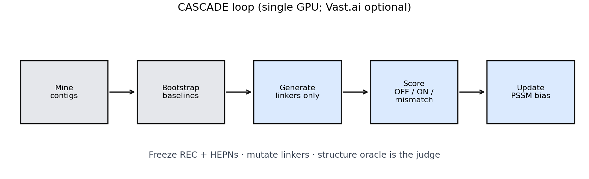

# Summary

CASCADE is software for finding Cas13-like proteins in assembled contigs and
for redesigning the **linkers** between their catalytic domains. The RNA-binding
region and the HEPN active-site sequences stay fixed. Generators
(PXDesign, ProteinMPNN) only change the mechanical parts. A structure model
(Protenix or Cattle-Prod) then scores each design twice: without the trigger
RNA (OFF) and with it (ON), plus simple mismatch controls. Relative scores
update a bias matrix for the next round of ProteinMPNN. The worked example is
three *Listeria booriae* Cas13a proteins aimed at tumor fusion RNAs *in
silico*. Nothing here is wet-lab validated.

# Statement of need

Structure models [@abramson2024af3; @protenix2024] and inverse folding
[@dauparas2022mpnn] are easy to call once, but hard to run as a closed loop
without wrecking catalysis or chasing fold confidence instead of a real
switch. Guide-oriented CRISPR tools such as ADAPT [@metsky2022adapt] and
BADGERS [@badgers2024] optimize detection guides. CASCADE does something
different: keep the native crRNA pocket, keep the HEPN sequences, and search
only the inter-domain linkers under OFF/ON/mismatch structural scores. It also
ships a strict miner that records *why* an ORF was rejected, because early
loose mining filled catalogs with glycoside hydrolases and other
non-Cas13 folds [@cascade_audit2026].

# State of the field

Most design stacks mutate large fractions of a chain for interface or monomer
metrics. CASCADE is narrower: a freeze / mutate / score policy for multi-domain
RNA-gated enzymes, with HEPN stitching after generation and a JSONL log for
later fine-tuning [@wang2024drakes]. Generators and oracles stay external
(Apache-2.0 / MIT code; weights downloaded separately).

# Software design

The pipeline has three phases:

1. **Mine** (`mining_v3`) — ORF length filter, canonical `R-X(4-6)-H` HEPN
   pairs, hard anti-signatures, reciprocal alignment to a small Cas13
   reference set, CRISPR-array–aware direct-repeat assignment, rejection
   reasons for every drop.
2. **Bootstrap** — SQLite annotation, HEPN anchors, optional mini/base
   structure screens, native DR attached as crRNA.
3. **Evolve** (`evolution_orchestrator.py`) — Gen 0 scores the wild-type
   enzyme. Gen 1 proposes linker backbones (PXDesign). Later generations
   inverse-fold a cached backbone with ProteinMPNN while most positions stay
   frozen; the fraction of free linker sites rises from about 10% to 50%.
   Wild-type HEPN segments are stitched back before scoring. Cheap OFF/ON
   predictions gate which designs get expensive ternary and mismatch jobs.
   `EvolutionGym` turns relative fitness into a ProteinMPNN PSSM (EMA on
   mutation keys). That is online search guidance, not a trained RL policy.

Science runs from `scripts/evolution_orchestrator.py` or
`scripts/smoke_gpu.sh`. Cloud fan-out is optional.

# Demonstration: three Cas13a baselines and designed morphs

## The three proteins that survived remine

After quarantining false positives from an earlier miner, strict remine kept
three *L. booriae* Cas13a ORFs with adjacent CRISPR arrays [@cascade_audit2026]:

| ID (pipeline) | Contig | Length (aa) | Native DR (RNA, truncated) | Best ref (id / aa) |
|:--------------|:-------|----------:|:---------------------------|:-------------------|
| `NZ_JAASWF…_HIGH` | NZ_JAASWF010000012.1 | 1052–1064 | `UACCUCAAAACAGAAGAGGACUA…` | LseCas13a ~39% / ~1028 aa |
| `NZ_JAAROR…_HIGH` | NZ_JAAROR010000001.1 | 1056 | `GAGUACCUCAAAACAGAAGAGGACUAAA…` | LseCas13a ~39% / ~1020 aa |
| `NZ_JAARYF…_HIGH` | NZ_JAARYF010000017.1 | 1052 | `GAUUUAGAGUACCUCAAAACAGAAGAGG…` | LseCas13a ~39% / ~1016 aa |

Each has nine canonical HEPN motif pairs in the remine report and a Cas13a-like
36-nt DR family. They are close to known *Listeria* Cas13a (including
sequences related to patented LbuCas13a) — useful scaffolds, not “Cas13e dark
matter.” Campaign 2 contigs (*Bacteroides* / *Flavobacterium* /
*Leptotrichia*) produced **0/102** acceptances under the same filters
(\autoref{fig:mining}).

{#fig:mining}

**Possible uses (hypothesis only).** With a spacer against a tumor fusion
junction (BCR-ABL1, EWSR1-FLI1, TMPRSS2-ERG, … in `data/fusion_targets.json`),
these enzymes are starting points for an RNA-triggered collateral RNase that
should stay quiet without the junction. The same scaffolds can also support
ordinary Cas13 detection assays if the goal is diagnostics rather than
cell-restricted activity. Both stories need wet-lab proof.

## Mutation strategy

Domain metadata for the three baselines places HEPN1 at residues 484–594 and
HEPN2 at 795–905 (1-based). The search therefore concentrates on:

- the pre-HEPN1 stretch (REC + first inter-domain linker), especially the
  **475–484** window at the HEPN1 border, and
- **IDL2 (595–794)** between the two HEPNs, where top-quartile designs
  repeatedly mutated sites around **700–780**.

Catalytic HEPN sequences are never supposed to enter the PSSM; stitch failures
are penalized. Gen 1 explores backbone geometry; Gen 2+ rethreads sequence on
a fixed backbone with temperature annealing and bias-weighted unfreeze.

{#fig:evo}

{#fig:hot}

## Morphs worth testing next

No design in the archived GPU runs met the strict “elite” cut
(ipTM ≥ 0.85 and ON ≤ 12 Å). Several morphs on the **JAAROR** lineage still
stand out for wet-lab triage because they combine a large OFF→ON distance
shift with the best composite fitness in the run. Lead example
`L59c434_g02_v28`: fitness ≈ 31.5, OFF ≈ 66 Å, ON ≈ 20 Å, ipTM ≈ 0.34,
clustered linker substitutions including `475_M … 484_S` and `595_I/596_L`
(full shortlist in `paper/figures/wetlab_shortlist_JAAROR.csv`). Treat these
as **computational shortlists**: synthesize, express, and assay collateral
cleavage on fusion RNA vs mismatched / healthy transcripts before any
biological claim.

The JAASWF worker run improved OFF/ON separation less and stayed at negative
fitness — useful as a negative control for the same protocol.

# Research impact statement

CASCADE ships CPU tests, setup scripts, Apache-2.0 licensing with third-party
weight notices, dual-use notes, and frozen mining tables in-repo. GPU
campaign artifacts (JSONL, bias matrices, shortlists) are packaged by
`scripts/build_zenodo_bundle.py` and attached to the `v0.1.0` GitHub release.
Figures above are generated from those runs via
`scripts/build_paper_figures.py`.

# AI usage disclosure

Coding assistants helped with packaging and an earlier draft of this paper.
This revision is rewritten around the mining remine and the JAAROR/JAASWF
evolution logs. Claims were checked against those files. Assistants were not
used as a stand-in for experiments.

# Acknowledgements

Built on Protenix, PXDesign, ProteinMPNN, and related open tools. No grant
funding is claimed for this release.

# References
